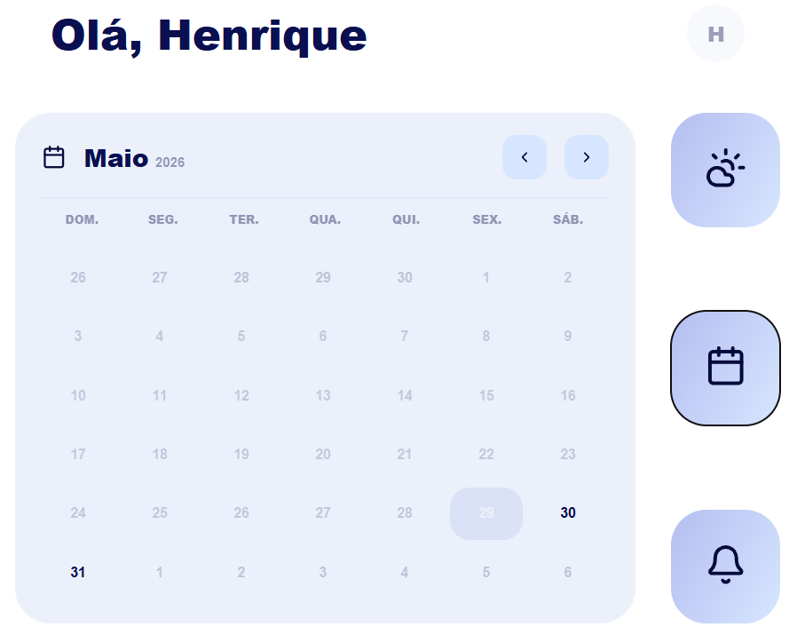
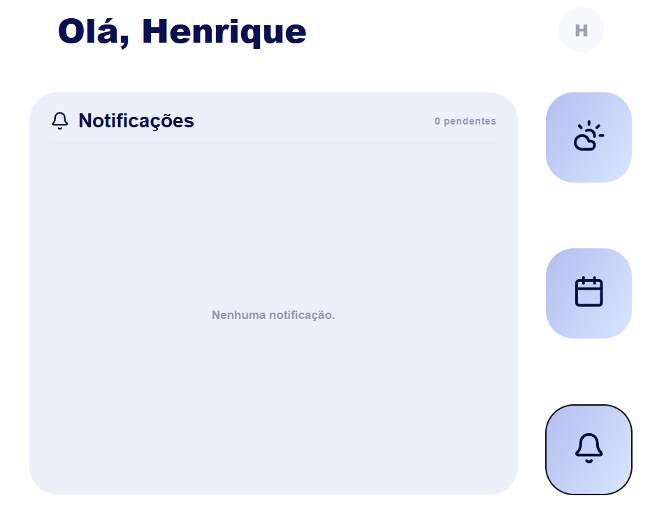
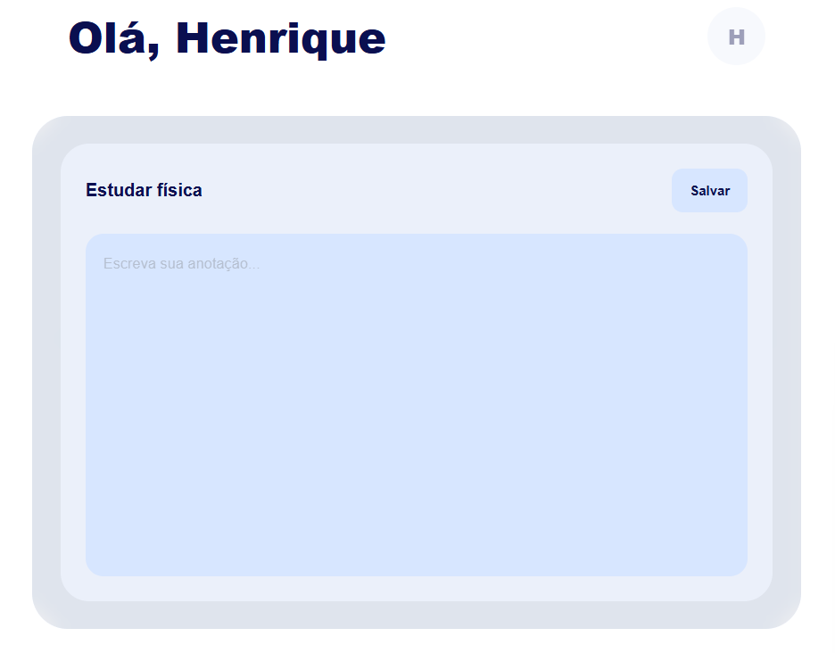
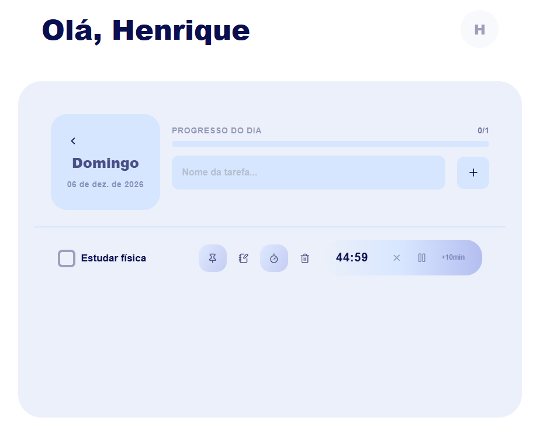

## Sobre mim

[GitHub Academico](https://github.com/dvsous)

[GitHub](https://github.com/hnrsous)

[LinkedIn](https://linkedin.com/in/hnrsous)

# FOCUS: Gerenciamento de tarefas

Aplicativo de gerenciamento de tarefas diárias com timer Pomodoro, calendário e notificações - construído em React.

## Telas







## Funcionalidades

- **Autenticação** — Login, cadastro e recuperação de senha (mock service pronto para integrar com Firebase ou outra API)
- **TodayCard** — Painel inicial com data atual e progresso do dia
- **Gerenciador de Tarefas** — Adicione, conclua, fixe e delete tarefas por dia
  - Fixar até 3 tarefas (pin)
  - Anotações por tarefa
  - Timer Pomodoro individual por tarefa
- **Calendário** — Navegue entre meses e abra tarefas de qualquer data; dias passados com tarefas ficam acessíveis
- **Notificações** — Lista de tarefas pendentes futuras ordenadas por data, com marcação de leitura
- **Pomodoro** — Timer configurável com modo trabalho/pausa, controles de play/pause e +10min
- **Barra de Progresso** — Acompanhamento visual das tarefas concluídas no dia

## Como rodar

### Pré-requisitos

- Node.js 18+
- npm ou yarn

### Instalação

```bash
git clone https://github.com/seu-usuario/focus.git
cd focus
npm install
```

### Desenvolvimento

```bash
npm start
```

### Build

```bash
npm run build
```

## Dependências principais

| Pacote         | Uso           |
|----------------|---------------|
| `react`        | Interface     |
| `lucide-react` | Ícones        |